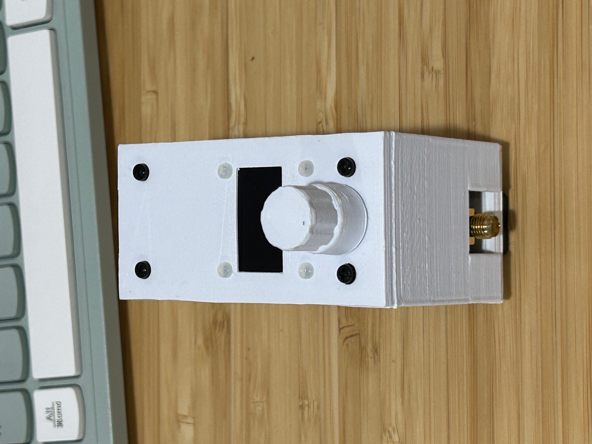
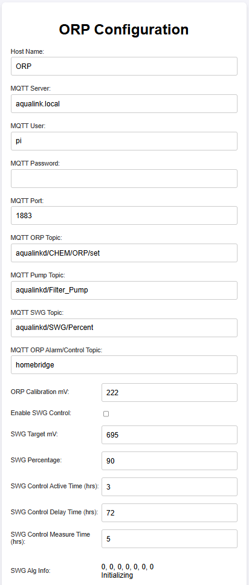

# Pool ORP Monitor Device

This project provides a Pool ORP Monitor device using the following parts:

  * Seeed Studio XIAO ESP32C6 with WiFi support external antenna
  * 0.96" LCD Display
  * Rotary Switch
  * Atlas Lab Grade ORP Probe
  * Atlas EZO ORP Circuit Board
  * Atlas EZO Carrier Board
  * Custom connection board to connect them
  * 3D print housing with nylon 2.5mm hex spacer/screws

The device will send ORP reading from Atlas probe to a MQTT broker. By default it is configured to send ORP reading to AquaLinkD ORP. Though, you should be able to publish any message to MQTT broker.

# How To Assembly the ORP Monitor Device

After you have printed the mounting housing (from folder models), perform the following steps:

  1. Attach 35MM DIN rail bracket
  2. Attach some nylon spacer
  3. Attach the Atlas EZO Carrier Board
  4. Attach the Atlas ORP Circuit Board
  5. Attach some nylon spacer
  6. Make a custom board to house the ESP32C6 with some JST connectors. Then drill hole using the 3D printed template
  7. Attach some nylon spacer
  8. Slide the side cover in
  9. Create connector wire and attach them
  10. Attach the LCD to the top board with some nylone screws (2mm)
  11. Screw in some nylon screw

Better to see images below.

# How To Configure WiFi

After you have programmed the arduino code using Arduino IDE, perform the following steps:

  * Download the SmartConfig app. For iPhone, it is called "SmartConnect". Then start the app and set your WiFi password with the app.
  * On the ORP device, connect USB power
  * Press the button to enter menu
  * Select "WiFi Setup"

After this, wait on the mobile app. In around 2 or 3 minutes, it would configure the WiFi network and password.

# How To Configure System Setting

To configure system setting such as MQTT broker, ORP calibrate value, etc, open a browser and entry the IP address as ``http://<ip address>``.

You should the below image. Configure the host name, MQTT Server name, user, password, port, and topic. If your ORP calibration solution isn't 225 mV, change the ORP calibration value. Then click on the "Submit" button.

# How To Calibrate ORP Probe

To calibrat ORP probe, perform these steps:

  1. Push the button
  2. Select "CAL ORP" and push the knob to start ORP calibration
