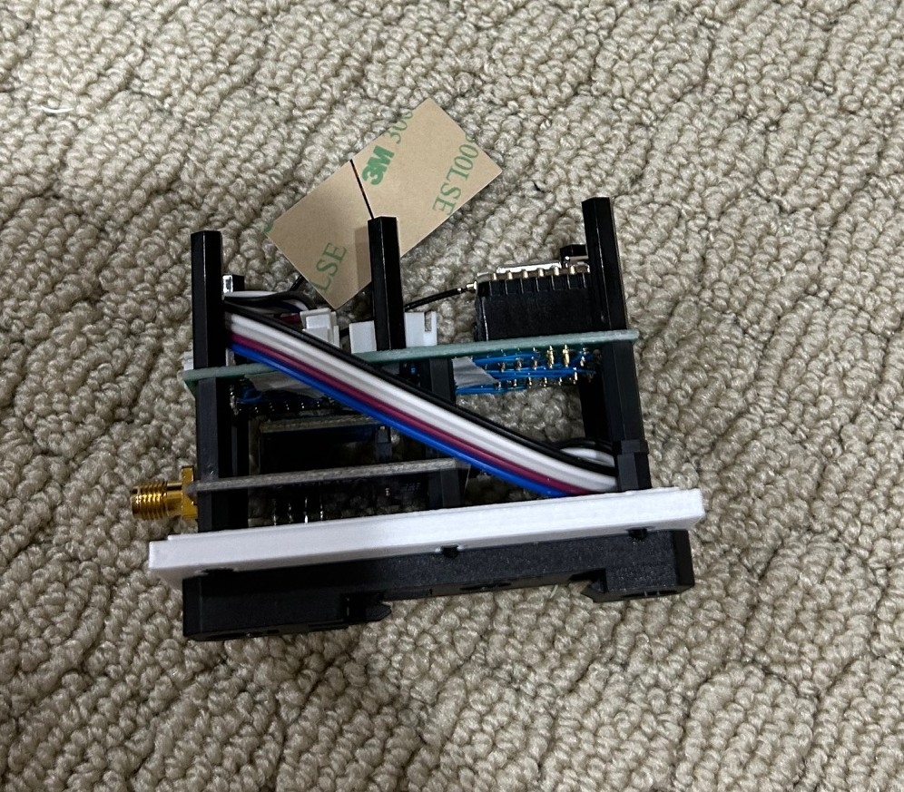
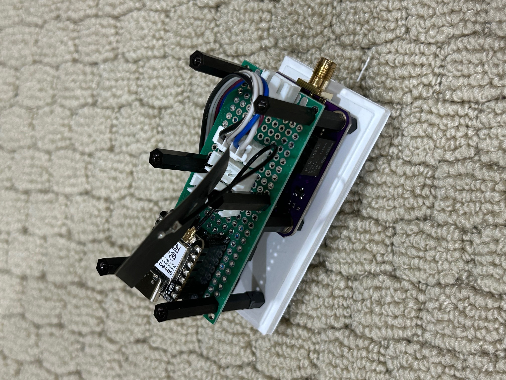
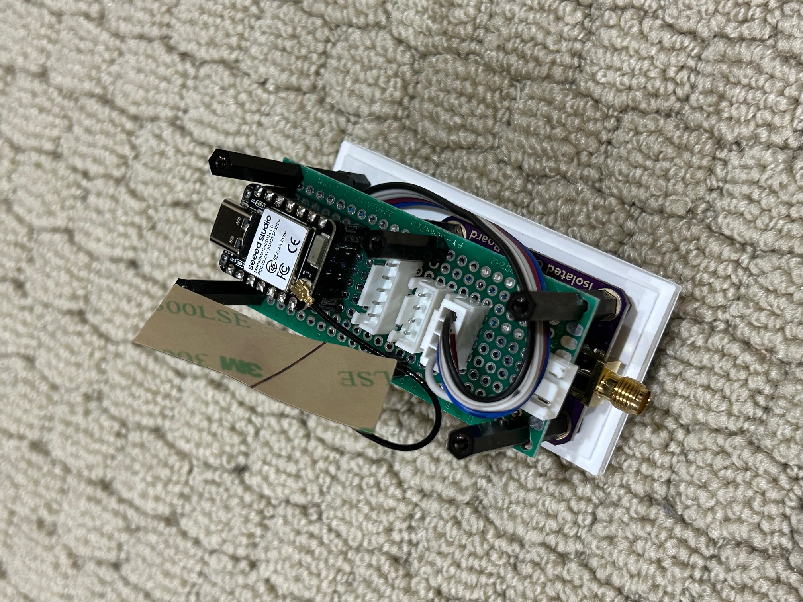
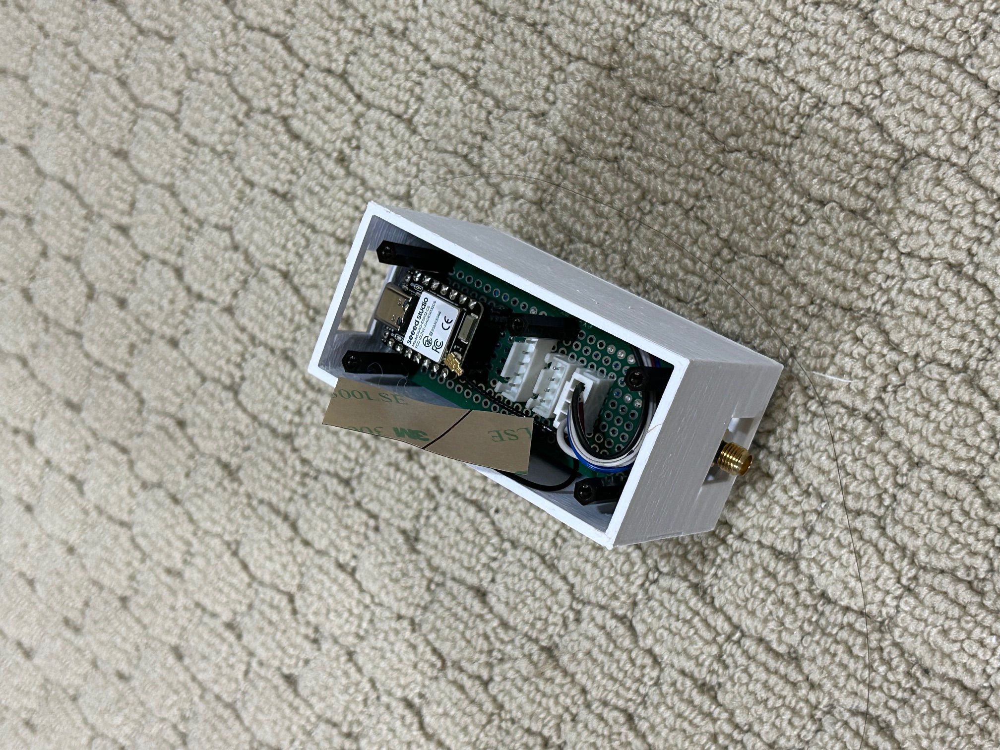
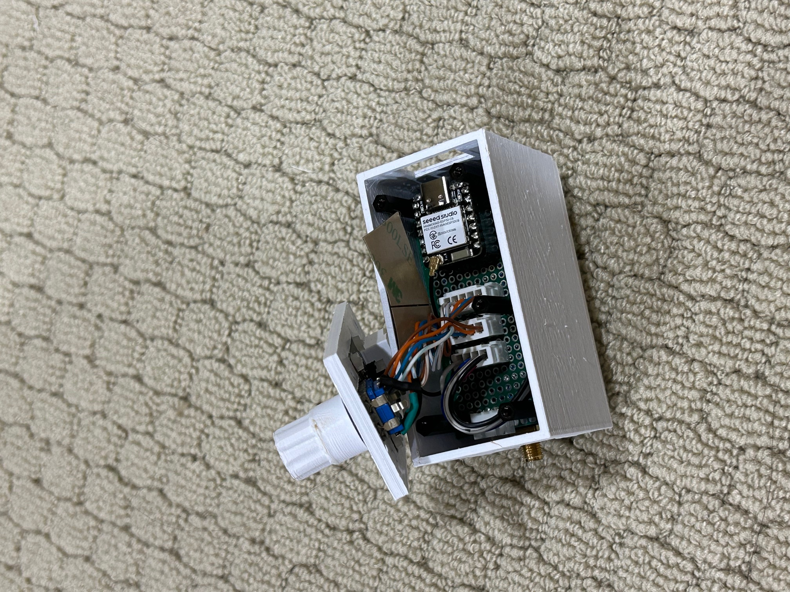
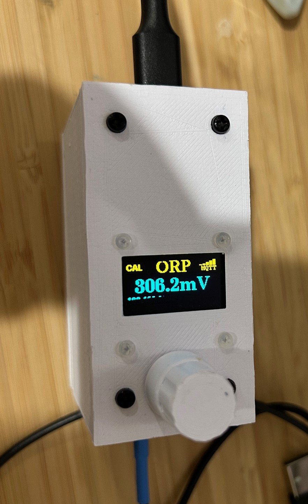

# WiFi Pool ORP Monitor Device

This project provides a WiFi Pool ORP Monitor device using the following parts:

  * Seeed Studio XIAO ESP32C6 with WiFi support external antenna
  * 0.96" LCD Display
  * Rotary Switch
  * Atlas Lab Grade ORP Probe
  * Atlas EZO ORP Circuit Board
  * Atlas EZO Carrier Board
  * Custom connection board to connect them
  * 3D print housing with nylon 2.5mm hex spacer/screws

The device will send ORP reading from Atlas probe to a MQTT broker. By default it is configured to send ORP reading to AquaLinkD ORP. Though, you should be able to publish any message to MQTT broker.

# How To Assemble the ORP Monitor Device

After you have printed the mounting housing (from folder models), perform the following steps:

  1. Attach 35MM DIN rail bracket to base plate
  2. Attach some on 6 holes nylon spacer (3mm or so)
  3. Attach the Atlas EZO Carrier Board with some nylon spacer. Did measure the spacer height.
  4. Attach the Atlas ORP Circuit Board
  5. Make a custom board to house the ESP32C6 with three JST connectors. Then drill hole using the 3D printed template. 3 pins, 4 pins and 5 pins. This is to connect the rotary, LCD, and Atlas RS232 to ESP32C6 board. All you need is Vcc, GND, Rx, Tx, I2C, and some digital pin. For pin, see the Ardiuno source code. Attach the external WiFi antenna. See the image below. This is the green board.
  6. Attach some nylon spacer (did not measuer the spacer height)
  7. Slide the side cover in. The total height should be equal to the cover height.
  8. Create connector wire and attach them
  9. Attach the LCD to the top board with some nylone screws (2mm screw)
  10. Screw in some nylon screw

Better to see images below.

# How To Configure WiFi

After you have programmed the arduino code using Arduino IDE, perform the following steps:

  * Download the SmartConfig app. For iPhone, it is called "SmartConnect". Then start the app and set your WiFi password with the app.
  * On the ORP device, connect USB power
  * Press the button to enter menu
  * Select "WiFi Setup" and push the button
  * On the app, tap to start WiFi configuration

After this, wait around 2 to 3 minutes on the mobile app. This will configure the WiFi network and password.

# How To Configure System Setting

To configure system setting such as MQTT broker, ORP calibrate value, etc, open a browser and enter the IP address as ``http://<ip address>``.

You should see the below image. Configure the host name, MQTT Server name, user, password, port, and topic. If your ORP calibration solution isn't 225 mV, change the ORP calibration value. Then click on the ``Submit`` button.

# How To Calibrate ORP Probe

To calibrat ORP probe, perform these steps:

  1. Push the button
  2. Select "CAL ORP" and push the knob to start ORP calibration

# How to Read the LCD Screen

The "CAL" indicates that the ORP has been calibrated. If there is an X over it, then it is not calibrated.

The upper right WiFi bar indicate the WiFi RSSI strength.

The "MQTT" indicates that it is connected to a MQTT broker.

The IP address on the screen shows its IP address.

The screen will turn off after some idle time. Press the button to show the screen.

